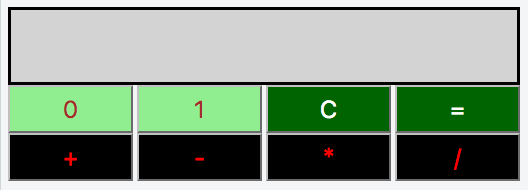
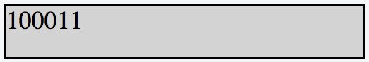
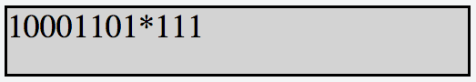
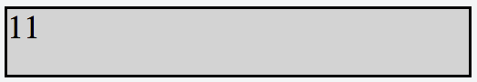

  <h2>Palindrome Checker</h2>

<h3>Objective</h3>

In this challenge, we implement a calculator that uses binary numbers. 
;

<h3>Constraints</h3>

+ All expressions in the test dataset are entered in the form `operand1 -> operator -> operand2`, where `operand1` is the first binary number, `operand2` is the second binary number, and `operator` is in the set `{+ , - , * , =}`.
+ Both operands will always be positive integers when converted from base-**2** to base-**10**.
+ All expressions will be valid.

<h3>Explanation</h3>
Consider the following sequence of button clicks:

     1 -> 1 -> 0 -> 1 -> 1 -> + -> 1 -> 0 -> 0 -> 0 -> = 

Before pressing the **=** button, the result div looks like this:

;

After pressing the **=** button, the result div looks like this:

;

Notice that (11011)2 = (27)10 , (1000)2 = (8)10 , and  (100011)2 = (35)10 so our calculator evaluated the expression correctly.

Now, let's consider our next sequence of button clicks as:

    0 -> 1 -> * -> 1 -> 1 -> 1 -> = 

Before pressing the **=** button, the result div looks like this:

;

After pressing the **=** button, the result div looks like this:

;

Consider the next sequence of button clicks as:

    C -> 1 -> 1 

The result div looks like this:

;

[*The source is from HackerRank*
](https://www.hackerrank.com/challenges/js10-binary-calculator)